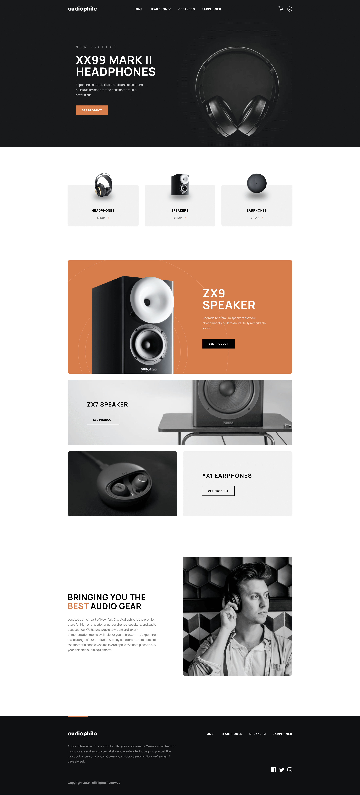

# Audiophile - Boutique e-commerce

### Links

- Live Site URL: [Audiophile](https://audiophile.bwat.live)

## Screenshot

## Fonctionnalités :

Login / Inscription -- OK \
Parcours par catégories -- OK \
Parcours des articles -- OK \
Mise au panier -- OK \
Ajustement des quantités -- OK \
Validation de la commande -- OK \
Ajout d'un produit -- OK \
Ajout d'une catégorie -- OK \

## Commandes

### `composer install` 
### `php bin/console sass:build`
### `symfony server:start`

# Auteurs

|                                                                      |                                                                                |
| -------------------------------------------------------------------- | ------------------------------------------------------------------------------ |
|  |  |
| [**Jacques**](https://github.com/JacqueVerc)                                | [**Alexandre**](https://github.com/Alexandre-st)                         |

## Infos admin
Identifiants : admin@admin.fr
Mot de passe : admin1234

Routes pour accéder à l'ajout de catégorie et de produits depuis l'admin.
[Page admin ajout de catégorie]([https://audiophile.bwat.live](https://audiophile.bwat.live/admin/add/category))
[Page admin ajout de produit]([https://audiophile.bwat.live](https://audiophile.bwat.live/admin/add/product))

Pour le paiement ne pas passer par l'admin 

## Infos user
Identifiants : test@test.fr
Mot de passe : test1234

Bien sûr vous pouvez créer un utilisateur. 